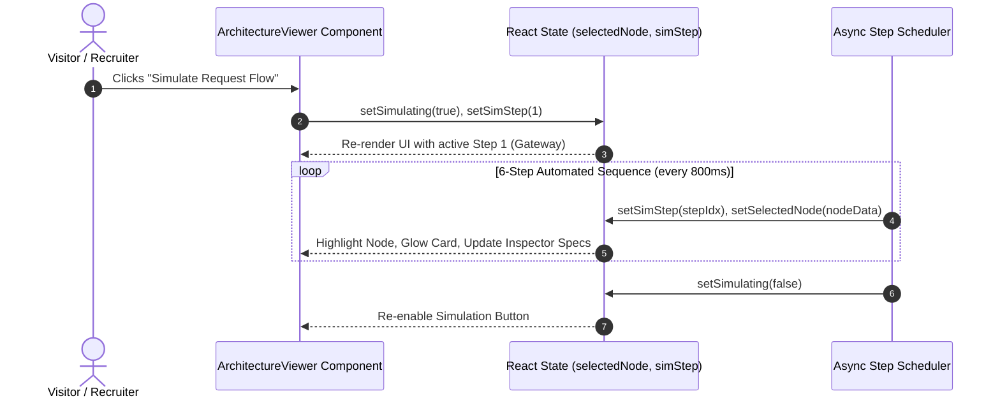
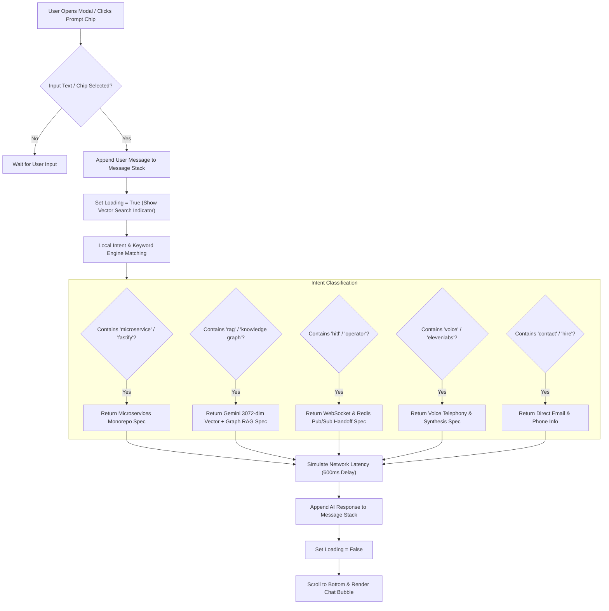
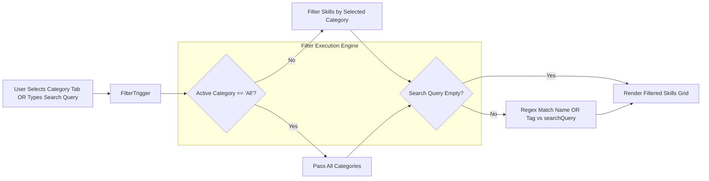

# Portfolio Web Application Architecture & Technical Specification

**Application Name:** Haider Bharmal AI Engineer Portfolio Website  
**Tech Stack:** React 18, Vite 8, Tailwind CSS v4, Lucide React Icons  
**Target Environment:** Modern Web Browsers (Chrome, Safari, Firefox, Edge)  
**Project Path:** `/Users/NKS-MBP-032/.gemini/antigravity/scratch/haider-bharmal-portfolio`  

---

## 1. Executive Overview & Frontend Blueprint

This web application is an interactive single-page application (SPA) designed with a high-end AI dark-mode glassmorphism aesthetics (`#060913` background, `#10B981` emerald & `#06B6D4` cyan neon accents).

### Primary System Capabilities
* **Component-Driven Modular Architecture**: Clean separation between structural components, interactive state engines, custom SVG icon libraries, and centralized data configuration (`resumeData.js`).
* **Interactive Monorepo Architecture Explorer**: Built-in state machine allowing users to inspect microservice nodes (`gateway`, `auth`, `bot`, `knowledge`, `hitl`, `realtime-audio`) or run an automated 6-step request flow simulation.
* **Client-Side RAG AI Assistant Modal**: Interactive chat widget simulating vector retrieval and streaming response generation with preset prompt chips.
* **Dynamic Skill & Project Filtering**: Real-time category switching and fuzzy search filter over skills and project deep-dives.
* **Clipboard & Contact Terminal Daemon**: One-click email/phone copying and interactive message transmission form.

---

## 2. Component Tree & System Architecture

### 2.1 Application Component Hierarchy

```mermaid
flowchart TD
    App["App.jsx (Main Container Shell)<br/>- State: aiModalOpen (Boolean)"]

    subgraph Nav ["Navigation Layer"]
        Header["Header.jsx<br/>- Sticky Glass Nav<br/>- Mobile Menu Drawer<br/>- AI Assistant Trigger"]
    end

    subgraph Sections ["Main Content Sections"]
        Hero["HeroSection.jsx<br/>- Status Pill & Terminal Preview<br/>- Quick Copy Email<br/>- Metrics Summary Grid"]
        Arch["ArchitectureViewer.jsx<br/>- Selected Node Inspector<br/>- Request Flow Simulator Engine"]
        Exp["ExperienceSection.jsx<br/>- Timeline View<br/>- Engineering Milestones"]
        Proj["ProjectsSection.jsx<br/>- Category Filter Tabs<br/>- Project Detail Modal"]
        Skills["SkillsSection.jsx<br/>- Category Filter & Search Input<br/>- Skill Badge Grid"]
        Edu["EducationSection.jsx<br/>- Academic Honors & Coursework"]
        Contact["ContactSection.jsx<br/>- Terminal Contact Cards<br/>- Copy Triggers & Message Form"]
        Footer["Footer.jsx<br/>- Copyright & Smooth Back-to-Top"]
    end

    subgraph Modals ["Global Overlays"]
        AiModal["AiAssistantModal.jsx<br/>- RAG Response Stream Engine<br/>- Preset Prompt Chips<br/>- Message History Stack"]
    end

    App --> Header
    App --> Hero
    App --> Arch
    App --> Exp
    App --> Proj
    App --> Skills
    App --> Edu
    App --> Contact
    App --> Footer
    App --> AiModal
```



---

## 3. Interactive State Machines & Flow Diagrams

### 3.1 Architecture Explorer Request Flow Simulator



---

### 3.2 "Ask AI" Assistant Client-Side RAG Search Flow



---

### 3.3 Skill Search & Category Filter Engine Flow



---

## 4. Centralized Data Architecture (`resumeData.js`)

The web application decouples presentational logic from underlying content using a centralized, immutable JavaScript object schema (`src/data/resumeData.js`).

```
resumeData Schema
├── personal { name, title, tagline, location, phone, email, status, summary }
├── metrics [ { label, value, detail } ]
├── skills [ { category, icon, items: [ { name, level, tag } ] } ]
├── experience [ { role, company, period, highlights, techStack } ]
├── projects [ { id, title, category, summary, impactStats, features, technologies } ]
├── architectureNodes [ { id, name, tech, color, desc } ]
└── education { degree, honors, institution, period, score, courses }
```

---

## 5. Styling Engine & Glassmorphism Design Tokens

The application utilizes **Tailwind CSS v4** coupled with custom glassmorphic rules defined in `src/index.css`:

```css
/* Glassmorphism Panel Tokens */
.glass-panel {
  background: rgba(15, 23, 42, 0.6);
  backdrop-filter: blur(16px);
  -webkit-backdrop-filter: blur(16px);
  border: 1px solid rgba(255, 255, 255, 0.08);
}

.glass-panel-glow {
  background: rgba(15, 23, 42, 0.7);
  backdrop-filter: blur(20px);
  border: 1px solid rgba(16, 185, 129, 0.2);
  box-shadow: 0 0 25px rgba(16, 185, 129, 0.08);
}
```

---

## 6. Build & Production Bundling Pipeline

The portfolio website is compiled via Vite 8 and Rolldown ES bundler into static web assets (`dist/`).

```bash
npm run build
```

* **Output Bundle Structure**:
  * `dist/index.html` — Entry HTML document with Google Inter & JetBrains Mono fonts.
  * `dist/assets/index-*.css` — Minified Tailwind CSS directives and custom animations (42.89 kB).
  * `dist/assets/index-*.js` — Production Javascript bundle (261.81 kB).
* **Build Time**: ~212 ms.
